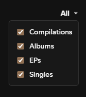

# Better Discography

Better Discography is a Spicetify extension that improves Spotify’s artist discography pages by adding a more detailed filter for release types.

## Features

<table>
  <tr>
    <td style="vertical-align: top; width: 60%; padding-right: 16px;">
      <ul>
        <li><strong>Filters discography by any combination of release types</strong>, including proper separation of Singles and EPs.
          <ul>
            <li>Compilations</li>
            <li>Albums</li>
            <li>EPs</li>
            <li>Singles</li>
          </ul>
        </li>
        <li><strong>Supports both list and grid view.</strong></li>
        <li><strong>Visual‑only filtering.</strong> Playback and queue remain unaffected.</li>
        <li><strong>Filters persist for the current session.</strong> They apply across all artist pages until Spotify restarts.</li>
        <li><strong>Removes Spotify’s built‑in filters</strong> for a cleaner UI.</li>
        <li><strong>Lightweight</strong> with near‑instant filtering.</li>
      </ul>
    </td>
    <td style="width: 40%; text-align: center;">
      
    </td>
  </tr>
</table>

## Installation (Manual)

1. Make sure you have **[Spicetify](https://spicetify.app/)** installed and working.
2. Download `better-discography.js` from the latest release.
3. Place the file into your Spicetify extensions folder:

    **Windows**
    
    `%appdata%\spicetify\Extensions`
    
    **macOS / Linux**
    
    `~/.config/spicetify/Extensions`

4. Open a console load the extension via Spicetify:

    `spicetify config extensions better-discography.js`

5. Apply your changes:

    `spicetify apply`

## Updating

Replace the old `better-discography.js` with the new one, then run `spicetify apply`.

---

### If this project was valuable to you, please feel free to [fund](https://ko-fi.com/michaelvail) my matcha addiction.